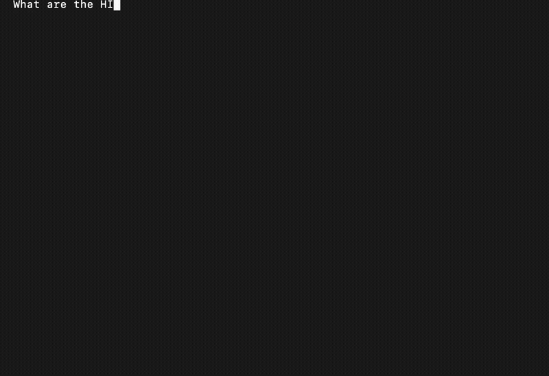

<h1 align="center">GrantAi</h1>

<p align="center">
  <strong>Deterministic Memory for AI</strong><br>
  Local. Private. Secure.
</p>

<p align="center">
  <a href="https://solonai.com/grantai">Website</a> •
  <a href="https://solonai.com/grantai/download">Download</a> •
  <a href="https://solonai.com/help/grantai">Documentation</a>
</p>

<p align="center">
  
</p>

---

## The Problem

Every AI system today has the same flaw: **it guesses instead of remembers.**

RAG (Retrieval-Augmented Generation) converts your documents into vectors — numerical approximations of meaning. When you query, it returns content that is *mathematically similar* to your question. Similar is not the same as correct.

Ask for "HIPAA encryption penalties" and RAG returns chunks that *look like* compliance content. Maybe the right section. Maybe adjacent paragraphs. Maybe hallucinated ranges. You pay for every token retrieved, whether relevant or not.

This is the **Retrieval Tax**:
- **Re-retrieval** — Same questions, same searches, same cost
- **Over-retrieval** — 20 chunks when you need 3
- **Labor** — Engineers tuning embeddings instead of building products
- **Risk** — Approximate answers in domains that require precision

Enterprise AI spends 85% of compute on inference. Most of that is wasted on retrieving content that doesn't answer the question.

## The Solution

GrantAi is **deterministic memory** for AI agents.

Instead of similarity search, GrantAi uses direct addressing. Every piece of knowledge has a unique identifier. Retrieval is a lookup, not a search. You get the exact content you indexed — verbatim, with attribution, in milliseconds.

| RAG | GrantAi |
|-----|---------|
| Returns *similar* content | Returns *the exact* content |
| 10-20 chunks, hope one is right | 1-3 sentences, always right |
| Slows down as corpus grows | Milliseconds regardless of size |
| No attribution | Full audit trail |
| Approximate | Deterministic |

**Result:** 97% reduction in tokens sent to the LLM. Faster responses. Lower cost. No hallucination from retrieval.

## Why It Matters

- **Compliance** — Exact citations, not paraphrased guesses
- **Multi-Agent** — Shared memory across your AI workforce with speaker attribution
- **Cost** — Pay for answers, not for searching
- **Security** — 100% local, AES-256 encrypted, zero data egress

## Quick Start

### macOS / Linux (Native)

```bash
# 1. Download from https://solonai.com/grantai/download
# 2. Extract and install
./install.sh

# 3. Restart your AI tool (Claude Code, Cursor, etc.)
```

### Docker (All Platforms)

```bash
docker pull ghcr.io/solonai-com/grantai-memory:1.8.6
```

Add to your Claude Desktop config (`~/.config/Claude/claude_desktop_config.json`):

```json
{
  "mcpServers": {
    "grantai": {
      "command": "docker",
      "args": ["run", "-i", "--rm", "--pull", "always",
               "-v", "grantai-data:/data",
               "ghcr.io/solonai-com/grantai-memory:1.8.6"]
    }
  }
}
```

## Supported Platforms

| Platform | Method | Status |
|----------|--------|--------|
| macOS (Apple Silicon) | Native | ✅ |
| Linux (x64) | Native | ✅ |
| Windows | Native | ✅ |
| All Platforms | Docker | ✅ |

## MCP Tools

GrantAi provides these tools to your AI:

| Tool | Description |
|------|-------------|
| `grantai_infer` | Query memory for relevant context |
| `grantai_teach` | Store content for future recall |
| `grantai_learn` | Import files or directories |
| `grantai_health` | Check server status |
| `grantai_summarize` | Store session summaries |
| `grantai_project` | Track project state |
| `grantai_snippet` | Store code patterns |
| `grantai_git` | Import git commit history |
| `grantai_capture` | Save conversation turns for continuity |

## Multi-Agent Memory Sharing

Multiple agents can share knowledge through GrantAi's memory layer.

### Basic shared memory (no setup required)

```python
# Any agent stores
grantai_teach(
    content="API rate limit is 100 requests/minute.",
    source="api-notes"
)

# Any agent retrieves
grantai_infer(input="API rate limiting")
```

All agents read from and write to the same memory pool. No configuration needed.

### With agent attribution (optional)

Use `speaker` to track which agent stored what, and `from_agents` to filter retrieval:

```python
# Store with identity
grantai_teach(
    content="API uses Bearer token auth.",
    source="api-research",
    speaker="researcher"  # optional
)

# Retrieve from specific agent
grantai_infer(
    input="API authentication",
    from_agents=["researcher"]  # optional filter
)
```

### When to use `speaker`

| Scenario | Use speaker? | Why |
|----------|--------------|-----|
| **Shared knowledge base** | No | All contributions equal, no filtering needed |
| **Session continuity** | No | Same context, just persist and retrieve |
| **Research → Code handoff** | Yes | Coder filters for researcher's findings only |
| **Role-based trust** | Yes | Security agent's input treated differently |

### Framework integration

GrantAi works with any MCP-compatible client. Point your agents at the same GrantAi instance:

```json
{
  "mcpServers": {
    "grantai": {
      "command": "docker",
      "args": ["run", "-i", "--rm", "--pull", "always",
               "-v", "grantai-data:/data",
               "ghcr.io/solonai-com/grantai-memory:1.8.6"]
    }
  }
}
```

All agents using this config share the same memory volume (`grantai-data`).

## Built By

GrantAi is built by [Lawrence Grant](https://linkedin.com/in/lawrencegrant), founder of [SolonAI](https://solonai.com).

Background: Harvard, IBM, AI architecture and security work for Blackstone, Goldman Sachs, and Vanguard. Author of *Mergers and Acquisitions Cybersecurity: The Framework For Maximizing Value*.

## Why We Built This

Read the full case for deterministic memory: **[Your AI Has Amnesia. You're Paying. Blame the Architecture.](https://solonai.com/grantai/essay)**

## Documentation

- [Installation Guide](https://solonai.com/help/grantai)
- [Troubleshooting](https://solonai.com/help/grantai#troubleshooting)

## Support

- **Issues** — [Open an issue](https://github.com/solonai-com/grantai/issues)
- **Email** — support@solonai.com

## License

Free to try. [Pricing & Terms](https://solonai.com/grantai/pricing)

---

<p align="center">
  <a href="https://solonai.com/grantai">Get Started →</a>
</p>
